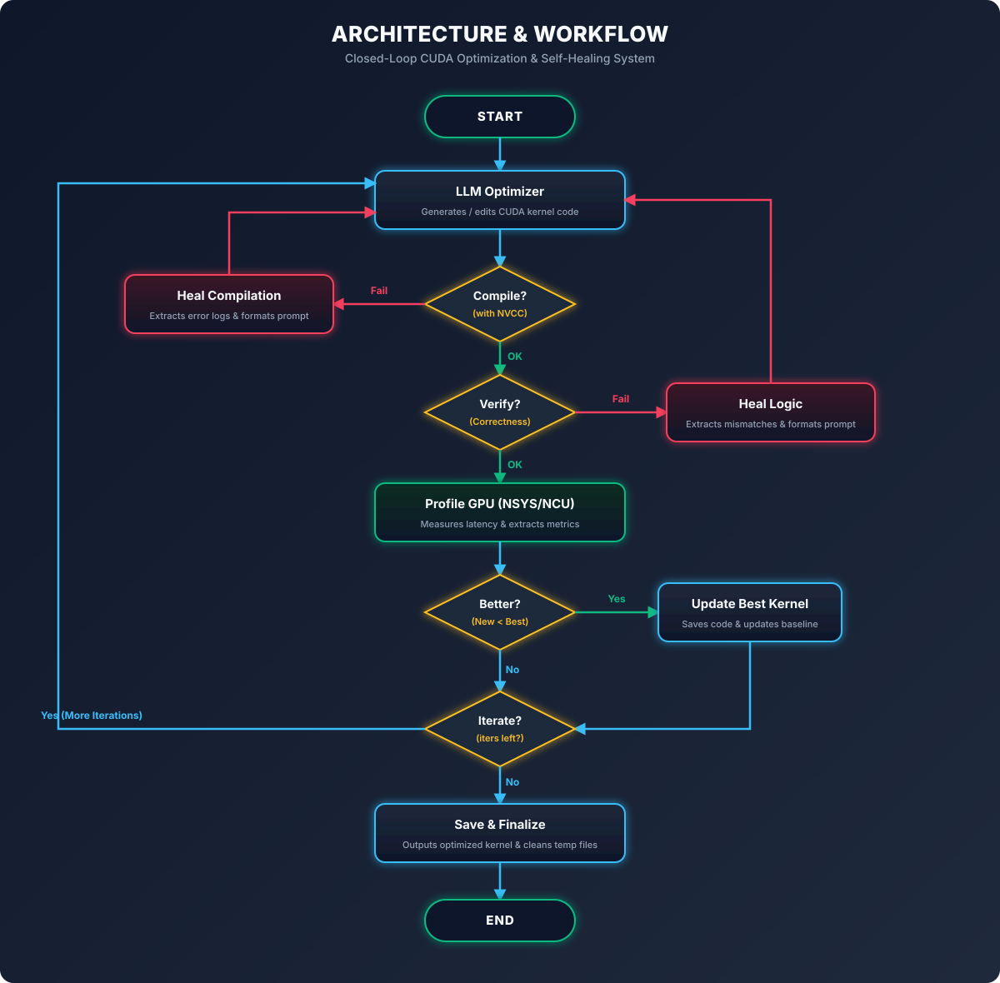

# cudallm-cli

[](https://github.com/ThemeHackers/cudallm-cli/actions/workflows/ncu-regression.yml)
[](LICENSE)

Local Autonomous CUDA Optimization Agent — A closed-loop tool that uses a local LLM to read, modify, compile, profile, and repair CUDA kernels automatically.

---

## Table of Contents
1. [What & Why](#what--why)
2. [Key Features](#key-features)
3. [Architecture & Workflow](#architecture--workflow)
4. [Prerequisites](#prerequisites)
5. [Installation](#installation)
6. [Quick Start](#quick-start)
7. [Detailed Command Reference](#detailed-command-reference)
8. [Advanced Core Workflows](#advanced-core-workflows)
   - [1. Autonomous Optimization & Self-Healing](#1-autonomous-optimization--self-healing)
   - [2. Expert Profiling Workflow (nsys → ncu)](#2-expert-profiling-workflow-nsys--ncu)
9. [Networking & Secure Deployment](#networking--secure-deployment)
10. [CI/CD Regression Checks](#cicd-regression-checks)
11. [Configuration Schema](#configuration-schema)
12. [Troubleshooting](#troubleshooting)

---

## What & Why
* **What**: An automated local toolchain for CUDA kernel performance engineering using an LLM-backed edit/compile/profile loop.
* **Why**: Manual CUDA optimization is a tedious process of tweaking parameters (block sizes, tiling, memory layouts), compiling, running profilers (`ncu`, `nsys`), interpreting reports, and fixing compilation errors. `cudallm-cli` automates this entire loop.

---

## Key Features
- **Closed-Loop Self-Healing**: Automatically captures NVCC compiler error logs and passes them back to the LLM to resolve syntax errors or API mismatches.
- **Mathematical Correctness Validation**: Verifies that optimized kernels generate output matching the baseline kernel before comparing execution speed.
- **Deep Profiling Integration**: Connects directly with NVIDIA Nsight Compute (`ncu`) and Nsight Systems (`nsys`) to collect exact hardware execution metrics.
- **Interactive Console Dashboard**: Visualizes execution logs, live hardware metrics (CPU, RAM, GPU, VRAM usage), and code diffs in real-time.
- **Custom Local LLM Server**: Packages `llama-server` with auto-update, GPU offloading, API key authentication, and TLS support.

---

## Architecture & Workflow

The diagram below illustrates the closed-loop optimization and self-healing process:



---

## Prerequisites
- **OS**: Windows (with PowerShell/Cmd) or Linux (Git Bash supported).
- **GPU**: NVIDIA GPU with up-to-date drivers.
- **CUDA Toolkit**: Recommended v12.x or v13.x (with `nvcc` added to your system path).
- **NVIDIA Nsight Tools**: Nsight Compute (`ncu`) and Nsight Systems (`nsys`) for advanced profiling modes.

Verify your environment tools:
```powershell
nvcc --version
ncu --version
nsys --version
```

---

## Installation

1. Clone the repository and navigate into the directory:
```powershell
cd cudallm-cli
```

2. Create and activate a Python virtual environment:
```powershell
python -m venv .venv
# On Windows:
& .\.venv\Scripts\Activate.ps1
# On Linux/macOS:
source .venv/bin/activate
```

3. Install the package in editable mode:
```powershell
pip install -e .
```

  If you want the optional GPU extras, install them with:
```powershell
pip install -e ".[gpu]"
```

---

## Quick Start

### Step 1: Scan Environment
Run the discovery command to scan for compiler tools, profilers, and GPU capabilities. Discovered paths will be saved in `config/config.json`:
```powershell
cudallm init
```

### Step 2: Launch Local LLM Server
Download and start `llama-server` automatically with GPU acceleration:
```powershell
cudallm serve --port 8080 --repo prithivMLmods/cudaLLM-8B-GGUF --file cudaLLM-8B.Q2_K.gguf
```

### Step 3: Run Kernel Optimization
Optimize a target CUDA kernel using the default 3-iteration self-healing loop:
```powershell
cudallm optimize path/to/kernel.cu -o optimized.cu --iters 3 --profile-mode auto --nvtx
```

---

## Detailed Command Reference

| Command | Arguments | Options | Description |
| :--- | :--- | :--- | :--- |
| `init` | None | None | Scans system paths, locates compiler/profiler executables, and persists configuration. |
| `doctor` / `check` | None | None | Displays a clean summary table of discovered paths and GPU capability. |
| `serve` | None | `--host`, `--port`, `--repo`, `--file`, `--ngl`, `--ctx`, `--api-key`, `--api-key-file`, `--ssl-key-file`, `--ssl-cert-file`, `--no-update` | Starts the GGUF LLM server locally. Automatically handles downloads, updates, and GPU layer offloading (`-ngl`). |
| `optimize` | `<file_or_folder>` | `-o/--output`, `-i/--iters`, `--target`, `--retries`, `--fast-math`, `-O/--opt-level`, `--profile-mode`, `--nvtx`, `--apply-nvtx`, `--ncu-metrics`, `--dry-run`, `--llm-url`, `--insecure` | Runs the iterative optimization agent. Supports dry runs, folder batches, custom compilers flags, and NVTX injections. |
| `expert` | `<exe_path>` | `--metrics`, `--run-deep`, `--code`, `--auto-nvtx`, `--rerun`, `--dry-run`, `--llm-url` | Performs advanced profiling on a compiled binary, identifies hotspots, runs deep NCU sweeps, and outputs LLM analyses. |
| `audit` | `<file_or_folder>` | `--markdown`, `--recursive/--no-recursive`, `--llm-url` | Performs a static structural audit on CUDA kernels using LLM prompts. Can output reports in Markdown format. |
| `ncu` | `<exe_path>` | `-o/--output`, `--metrics` | Direct wrapper to execute Nsight Compute, exporting performance metrics into a clean CSV file. |
| `nsys` | `<exe_path>` | `-o/--output`, `--code` | Direct wrapper to capture execution timelines using Nsight Systems. |
| `profile` | `<exe_path>` | `--mode [auto\|ncu\|nsys]`, `--metrics`, `--code` | Runs either NCU or NSYS based on availability. |
| `help` | None | None | Prints the plain text command reference page. |

---

## Advanced Core Workflows

### 1. Autonomous Optimization & Self-Healing
When running `cudallm optimize`, the tool starts a closed feedback loop:
* **The Harness**: A temporary verification harness is generated wrapping your CUDA kernel.
* **NVCC Compilation**: The harness is compiled. If compilation fails, the compiler error output is automatically sent to the LLM alongside the generated source code with a prompt to "heal" the compile errors.
* **Correctness Check**: Once compiled, the binary runs and compares its mathematical output values against the baseline kernel. If verification fails, this is also sent to the LLM to fix logical discrepancies.
* **Profiling**: Only mathematically correct kernels are profiled to determine execution time, protecting against empty or dummy speedups.

#### Key Flags:
* `--fast-math`: Injects `-use_fast_math` flags into compilation.
* `--nvtx`: Instruments the generated harness using NVTX ranges.
* `--profile-mode code`: Uses `cudaProfilerStart()` / `cudaProfilerStop()` inside the harness for precise profiling.

---

### 2. Expert Profiling Workflow (nsys → ncu)
The `cudallm expert` command profiles a pre-compiled CUDA binary, identifies bottleneck kernels, and recommends optimizations:

1. **Capture System Timeline**: Runs `nsys` to capture CPU-GPU interactions and execution markers.
2. **Broad Sweep**: Runs `ncu` collecting standard metrics like cycles and DRAM throughput.
3. **Hotspot Analysis**: Parses the output CSV to locate the kernel with the highest execution bottleneck.
4. **Deep Collection Recommendations**: Recommends a targeted `ncu` command for the specific hotspot kernel.
5. **Auto NVTX Suggestions**: Query the LLM with the profiling logs to automatically generate an `nvtx_suggestion.cu` instrumented file.

Example command:
```powershell
cudallm expert ./my_cuda_binary.exe --auto-nvtx --rerun
```

---

## Networking & Secure Deployment

`cudallm serve` is built to run securely on various environments:

### Wildcard Interfaces
Expose the server on local network interfaces using `--host 0.0.0.0`. When doing this, specify `--public-url` so other agents can resolve client routes:
```powershell
cudallm serve --host 0.0.0.0 --port 8080 --public-url http://192.168.1.100:8080/completion
```

### Security Credentials
To prevent unauthorized access, network-facing wildcards require either API Key authentication or TLS setup. You can bypass this check using `--allow-unsafe-network`.

* **API Key Auth**:
  ```powershell
  cudallm serve --host 0.0.0.0 --api-key-file .\secrets\keys.txt
  ```
* **TLS Encryption**:
  ```powershell
  cudallm serve --host 0.0.0.0 --ssl-key-file .\secrets\server.key --ssl-cert-file .\secrets\server.crt
  ```

---

## CI/CD Regression Checks

To prevent slow kernels from being merged into production repositories, `cudallm` includes scripts for automated CI regression testing.

### CSV Comparisons
`tools/compare_ncu.py` compares a baseline NCU CSV metrics file with a newly collected run:
```powershell
python tools/compare_ncu.py ci/baselines/baseline.csv ncu_output.csv -c dram__throughput.avg --threshold 0.02
```
* Returns exit code `3` if a regression exceeding the threshold (default 2%) is detected.

### Bash Regression Script
On Linux self-hosted runners, use the `ci/ncu_regression_check.sh` utility:
```bash
./ci/ncu_regression_check.sh ./my_compiled_kernel ci/baselines/kernel_baseline.csv "sm__cycles_elapsed.avg" "cycles"
```

---

## Configuration Schema

Config parameters are persisted inside `config/config.json`. Below is the schema structure:
```json
{
  "llm_url": "http://127.0.0.1:8080/completion",
  "llm_api_key": null,
  "llm_api_key_file": null,
  "llm_verify_tls": true,
  "llm_allow_insecure_remote": false,
  "max_stream_chunks": 2000,
  "nvcc_path": "C:\\Program Files\\NVIDIA GPU Computing Toolkit\\CUDA\\v13.0\\bin\\nvcc.exe",
  "nvidia_smi_path": "C:\\Windows\\system32\\nvidia-smi.exe",
  "ncu_path": "C:\\Program Files\\NVIDIA Corporation\\Nsight Compute 2026.1.1\\ncu.bat",
  "nsys_path": "C:\\Program Files\\NVIDIA Corporation\\Nsight Compute 2026.1.1\\host\\target-windows-x64\\nsys.exe",
  "llm_server_path": "C:\\Users\\1com310568\\Downloads\\cudallm-cli\\llama-b9209-bin-win-cuda-12.4-x64\\llama-server.exe",
  "last_discovery_at": "2026-05-19T20:25:00"
}
```

---

## Troubleshooting

* **Profiler Not Found Error**: If `ncu` or `nsys` show `Not Found`, run `cudallm init` to force a workspace path refresh after installing NVIDIA Nsight.
* **Empty NSYS Timelines**: If `nsys` reports do not display GPU kernel profiles, run with `--profile-mode code` to enable programmatic compiler activation or instrument kernels with NVTX.
* **Wildcard Bind Failures**: Ensure no other server instance binds to the specified port. Use `--reuse-port` on supporting host systems.
